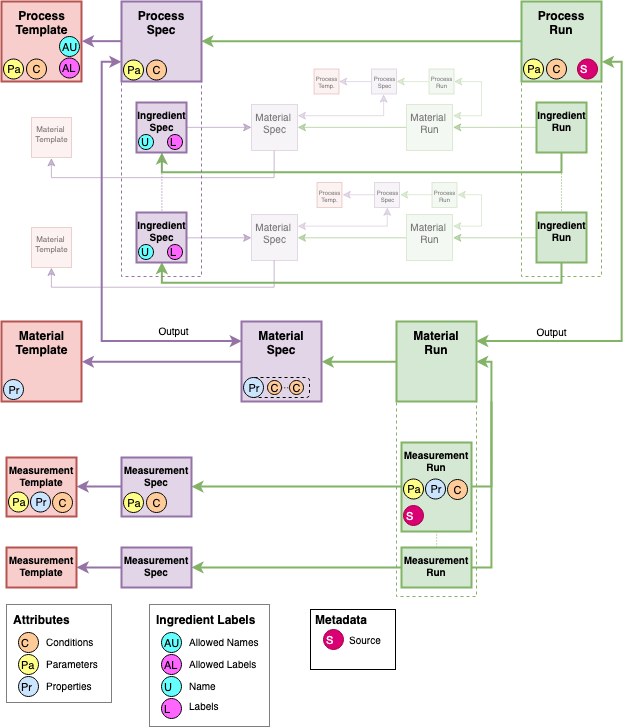
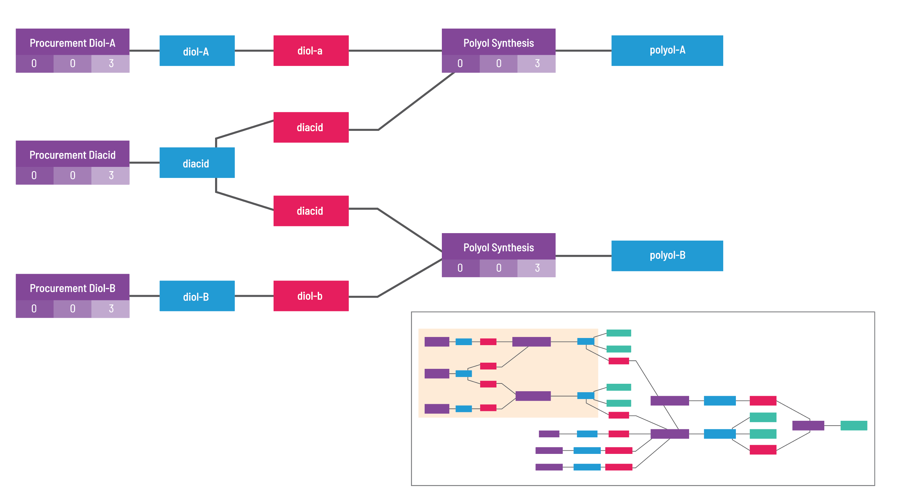

# High Level Overview

## How is data stored
GEMD stands for Graphical Expression of Materials Data. It's an open source format initially developed by the fine folks at Citrine Informatics.

GEMD stores data via interconnected Data Objects, representing Specs and Runs of Materials, Processing steps, Measurements, and Ingredient information.
This format is graphical rather than tabular.
It will support a JSON-based serialization, like the
[PIF](http://citrineinformatics.github.io/pif-documentation/), but with links as references rather than nested objects (i.e. subsystems).
Conversely, there are many new ideas that exist in GEMD that are not captured by the PIF, including:

* Process history and process order, including the input materials to process steps
* Conditions that are shared between properties
* Specified vs actual values
* Ingredient information of input materials of a process

Don't worry if that seems quite complicated right now.
The details are broken out in the coming sections.

## How are Data Objects defined?
A picture is worth a thousand words:

There are four categories of Data Objects in GEMD: Materials, Processes, Measurements, and Ingredients.
These represent real world objects in the development of materials.
The 4 categories of Data Objects can only be linked in specific ways, for example, a Process Object can only be linked to one or many Material Objects as its input, more details are explained in Table1.
Each Object can be represented in 3 different states, these states are defined below, they are Template, Spec, and Run.
Note, Ingredient Objects cannot be represented in the Template state.

* **Material Object:** Describes a material by a name used in an organization and optional notes to describe it.
* **Measurement Object:** Describes an operation used to measure or characterize one or more properties of a material and the parameters and conditions for that operations.
* **Process Object:** Describes an operation used with the goal of transforming a material.
* **Ingredient Object:** Annotates a material with information related to its usage in a process including `name` (label on the ingredient that is unique within the process that contains it) and `labels` (additional labels on the ingredient)

Object      | Examples   | Linked Objects | State | Possible Attributes
------------|------------|----------------|:-----:|--------------------
`Material`  | Glass, H2O | n/a | Template  | Properties
^      |      ^     | input: Process (1); Measurement (0 or many) | Spec | Properties and Conditions
^      |      ^     | ^ | Run | none
`Process` | Gas pressure sintering, Binder burnout | n/a | Template | Parameters and Conditions
^      |      ^     | input: Ingredient (0 or many); output: Material (1) | Spec | Parameters and Conditions
^      |      ^     | ^ | Run | Parameters and Conditions
`Measurement` | 3 point bend, combustion analysis | n/a | Template | Properties, Parameters, and Conditions
^      |      ^     | Material (1) |Spec | Parameters, and Conditions
^      |      ^     | ^ | Run | Properties, Parameters, and Conditions
`Ingredient` |      80wt%, 20lbs, solute     | Material (1) |Spec | n/a
^      |      ^     | ^ | Run | n/a

*Table1:* Shows the relation of Objects to other Objects and Attributes possible in each state.

## How are Attributes defined?

Each Data Object (except Ingredient Objects) can contain Attributes that describe it.
There are three different categories of Attributes: Properties, Parameters, and Conditions.
Attributes contain structured materials data that is representative of an Data Object.
For example, a Process Object can have Parameters and Conditions as such: “sinter at 2400 K for 6 hours in kiln 14”.

* **Property Attribute:** Describes a property that is measured or calculated, they are aspects of a material, e.g. “the hardness of the sample”.
* **Parameter Attribute:** Describes the settings of a tool that are set by the user for a specific purpose, e.g. “the size of the indenter” or “the grid spacing in a simulation”.
* **Condition Attribute:** Describes the aspects of the environment during a process or measurement, e.g. “the temperature of the environment during measurement”.

Each Attribute has specified fields that are required or optional as defined in Table3 and Table6 below.

## How are States defined?
There are 3 main states in which Data Objects exist: Templates, Spec, and Run.
GEMD distinguishes between the generalization of what might be done (Template), the intent to do something (Spec), and the actual result of doing it (Run).

> As an example, one can have a Template for a Process Object defined as “sinter at {temperature} for {time} in kiln {id}”.
This would be the Template used for a Spec of a kiln process used in the production of alumina.
The Spec of the Process object might be “sinter at 2400 K for 6 hours in kiln 14”.
The Process Run object would be what really happened when the process was conducted.
For example, someone may have run the kiln and it ran at 2395 K.
The Run of the Process object would be “sinter at 2395 K for 5.75 hours in kiln 14”.

All Data Objects (and all the Attributes that describe those Data Objects) in any State have specified fields that are required or optional, Table2 goes into further detail about the possible fields in all Data Objects and Attributes.

Field | Required/Optional | Quantity Possible
------|----------|-------------
`uids` | Optional | many
`tags` | Optional | many
`name` | Required | one

*Table2:* Defines the possible fields in all Data Objects and Attributes in all states

## Templates
Templates are generalizations of Data Objects used to standardize data in GEMD.
Templates are used at write time to validate data and at read time to associate groups of information together.
Each Spec and Run Object or Attribute (excluding Ingredient Objects and Metadata Attributes) requires a linked Template to support this read and write time association and validation respectively.

### Attribute Templates
An Attribute Template specifies the bounds that are acceptable for an Attribute.

For example, an Attribute Template could specify a Real value bounded between -3 and +17, or it could define a Categorical bound with the following allowed categories: "salt", "not salt".
The values of an Attribute with an Attribute Template must conform to the bounds specified by the Template.
If the value is not compatible with the Template (e.g. if the Template specifies that the value must be in the range [0, 1] but the value is 2), an error is thrown.

Table3 below defines the possible fields in all Attributes in the Template state.

Field | Required/Optional |  Quantity Possible
------|-------------------|--------------
`uids` | Optional | many
`tags` | Optional | many
`name` | Required | one
`description` | Optional | one
`bounds` | Required | one

*Table3*: Shows the fields available for Attributes in the Template state

The `scope` defines to which category of Attribute (Property, Parameter, or Condition) the Attribute Template applies.

### Object Templates
Object Templates are collections of Attribute Templates that together constrain the values of an Data Object's associated Attributes to valid ranges, and provide a common structure for describing similar Data Objects.

Object Templates are useful for validating that all Data Objects being written or generated by a script are consistent and valid.
In the future, Object Templates could be used to generate data input forms or similar interfaces.

Table4 below defines the possible fields in all Data Objects in the Template state.

Field | Required/Optional | Quantity Possible
------|-------------------|--------------
`uids` | Optional | many
`tags` | Optional | many
`name` | Required | one
`description` | Optional | one

*Table4*: Shows the fields available for each category of Data Object in the Template state

All Object Templates can also have additional Attribute Bounds set on defined Attributes.
These are additional bounds that can be applied to Attributes associated with that Data Object.
For example, consider there exists a Condition Attribute Template called "Oven Temperature" that is defined from 0 to 10,000 Kelvin and a Process Object Template that includes the "Oven Temperature" Condition Template.
Along with the Condition Template “Oven Temperature”, the Process Template can include additional Attribute bounds and restrict the values that can be applied to that Condition between 300 and 600 Kelvin.
That second restriction is represented by a second bound paired with the Condition Template in the Process Object Template.

Table5 below identifies all the possible Attributes that each Data Object can contain in the Template state.

Object Template | Property Template | Parameter Template | Condition Template
---------|----------|------------|------------
`Material Template` | yes | no | no
`Process Template` | no | yes | yes
`Measurement Template` | yes | yes | yes

*Table5*: Shows which Attributes can be linked to each Data Object in the Template state.

## Specs and Runs
Specs define the intent to do something, usually formalized in the format of an experiment request, the intention of an experiment, or the definition of a property.
For example, the normal boiling point of pure water is 99.61 C, a spec.

Runs describe how a material, process, or measurement were actually performed, defined, or evaluated and the end results of that evaluation.
For example, a sample of water boiled at 101 C, a run.

### Attribute in Specs and Runs
Each Attribute has specified fields that are required or optional for both Spec or Run state.
Table6 goes into further detail about the possible fields.
Table6 represents the Attributes in diagram.

Field | Required/Optional | Quantity Possible
------|-------------------|--------------
`name` | Required | one
`value` | Required | one
`notes` | Optional | one
`origin` | Required | one
`template` | Optional | one
`file_links` | Optional | many

*Table6*: Shows the fields available for Attributes in the Spec and Run context.

All attributes must specify the `origin` of their data as one of:

* Specified: it is the intention to have this value
* Measured: this was directly measured during the process or measurement run
* Computed: this was calculated based on other measured or derived properties
* Predicted: this was calculated based on a model, e.g. machine learning or simulation
* Summary: this was calculated based on a set of the same property at a finer level of granularity (aggregation of data)
* Unknown: the origin is not known, typically when migrating legacy data

A `value` is a complex type that may contain both central (i.e. expected) and distributional (i.e. uncertainty) information.
It also includes units for real (i.e. continuous) values.

### Data Object Specs and Runs
Object Specs require an associated Object Template that bounds the valid units and values of the Attributes on the Spec.

With the linking of Specs to Runs, Runs inherit associated Templates through Specs.
For example, Process Runs associated with a Process Spec inherit the Template associated with the Spec, and their Attributes are thus also constrained by the Template.

* Many Specs can reference the same Object Template.
* Each Spec can be associated with at most one Object Template (for now).
* Many Runs can reference the same Spec.
* Each Run must be associated with exactly one Spec.

As Object Specs define the intent to do something, they are more limited in possible fields than Runs.
Table7 represents what additional fields are required or optional for Object Specs.

Field | Required/Optional | Quantity Possible | Spec or Run
------|------------|---------------|-----
`uids` | Optional | many | both
`tags` | Optional | many | both
`name` | Required | one | both
`notes` | Optional | one | both
`file_links` | Optional | many | both
`template` | Optional | one | Spec
`spec` | Required | one | Run

*Table7*: Shows the fields available for Material, Measurement, and Process Objects in the Spec and Run contexts.

Ingredient Objects are treated a little differently from the other Objects in GEMD because they are mainly used to annotate a Material with information related to its usage in a Process.
Note that constraints on `name` and `labels` follow from the `allowed_names` and `allowed_labels` fields of the Process Template.
Table8 below identifies all the fields available in Ingredient Objects for both Specs and Runs.

Field | Required/Optional | Quantity Possible | In Spec or Run
------|------------|---------------|-----
`uids` | Optional | many | both
`tags` | Optional | many | both
`notes` | Optional | one | both
`file_links` | Optional | many | both
`name` | Optional | one | Spec
`labels` | Optional | many | Spec
`material` | Required | one | both (with material object from respective state)
`mass_fraction` | Optional | one | both
`volume_fraction`| Optional | one | both
`number_fraction`| Optional | one | both
`absolute_quantity`| Optional | one | both
`spec`| Required | one | Run

*Table8*: Shows the fields available for Ingredient Objects in the Spec and Run context.
