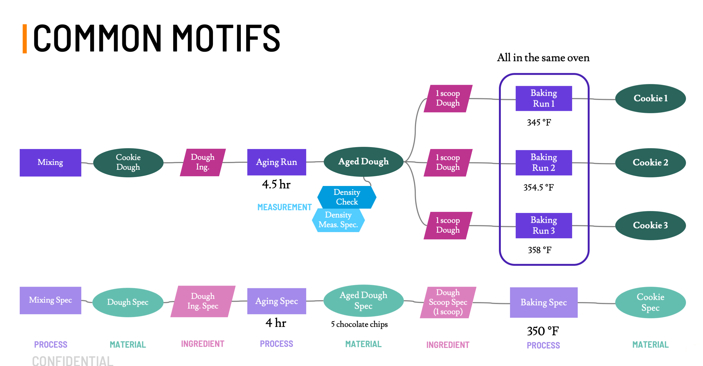

# Objects

There are two kinds of objects: Specs and Runs.
Specs represent the intent and expectation of the material, process, ingredient, or measurement,
while Runs capture what actually happened.
This captures natural variations and forms an association between samples and design as multiple Runs of the same Spec.

Specs are specific.
In `MaterialSpec`, `ProcessSpec`, `IngredientSpec`, and `MeasurementSpec` objects, `value` should be given nominal values, e.g.,
real-valued attributes on Specs should have [Nominal Values](../value-types/#nominal-real-values).
This is in contrast to another common usage of the term "Specification" (or tolerance) as a range of accepted values, e.g., "The material is in spec if the nitrogen impurity concentration is below 0.1%."
In this data model, that notion of a "spec" that an object can "be in" is an [Object Template](../object-templates).

Specs can have an [Object Template](../object-templates/) associated, which bounds the valid units and values of the [Attributes](../attributes) on the Spec.
Object Runs associated with an object Spec inherit the [Object Template](../object-templates/) associated with the Spec, and their [Attributes](../attributes) are thus also constrained by the [Object Template](../object-templates/).


* Many Specs can reference the same Object Template.
* Each Spec can be associated with at most one Object Template.
* Many Runs can reference the same Spec.
* Each Run must be associated with exactly one Spec.


The mechanism for [Attribute](../attributes) validation is through [Attribute Templates](../attribute-templates).
If the Attribute's template is set, the Attribute's [Value](../value-types) is validated against the constraints defined in that template.
If the [Object Template](../object-templates/) has further restricted the bounds of the Attribute Template, then those tighter constraints are enforced.
The Properties, Parameters and Conditions of Object Templates and of Objects are matched when they point at the same Attribute Template.

An [Object](../objects) can have [Attributes](../attributes) that are not defined in its [Object Template](../object-templates), and an Object Template can have Attributes that are not defined in associated Objects.
However, an Object cannot have two attributes of the same type (Property, Parameter, or Condition) with the same name or the same attribute template.

#### Material History

A material history is the complete set of objects that precede a [Material Run](#material-run) in time, as well as the associated Specs and Templates.
That final or ultimate material is called the `Terminal Material`.
Given a dataset of relevant objects, a Material History would be collected by choosing a Terminal Material and then recursively:

* extracting the process that generated it
* extracting the ingredients that went into that process
* extracting the materials that constituted those ingredients

until one reaches a point that a process has no recorded ingredients (e.g., I purchased a bag of flour).
The dataset itself may have a complicated web of relationships (e.g., I made 12 different loaves of bread from one bag of flour) and the material history is just one example of a way to consider that dataset.

Which materials would be considered terminal depend on context.
A steelmaker might consider a steel plate to be terminal in their process.
A machinist might take that plate as input for the dog bone they manufacture as terminal in their process.
A technician might take that dog bone as input to destructive testing, and then a scrapper would feed the broken dog bone back as feedstock for another steelmaker.
Every history has one terminal material.

#### Recipe

A recipe is the set of Specs and Templates that underlie a Material History.
It represents the set of steps to be attempted to produce a target material.
A recipe could be shared by many material histories or may just represent one.
A recipe and any associated material histories should share the same graph structure.

---
## Process Spec

An expectation of a process.
Processes transform zero or more input materials into exactly one output material.


Field name | Value type | Default | Description
-----------|------------|---------|-------------
`uids`        | Map[String, String] | Empty | A collection of [Unique Identifiers](../unique-identifiers)
`type`        | String     | Required | "process_spec"
`name`        | String     | Required | The name of the Spec
`notes`       | String     | None | Some free-form notes about the Spec.
`tags`        | Set[String]| Empty | [Tags](../tags)
`file_links`  | Set\[[File Links](../file-links)] | Empty | Links to associated files, with resource paths into the files API
`template`    | [Process Template](../object-templates/#process-template) | None | A template bounding the valid values for parameters and conditions on this process.
`parameters`  | Set\[[Parameters](../attributes/#parameters)] | Empty | Specified parameters for the Process Spec
`conditions`  | Set\[[Conditions](../attributes/#conditions)] | Empty | Specified conditions for the Process Spec
`ingredients` | Set\[[Ingredient Spec](./#ingredient-spec)] | Implicit | Ingredient Specs
`output_material` | [Material Spec](./#material-spec) | Implicit | Output Material Spec

##### Constraints

All [Attributes](../attributes) sharing an [Attribute Template](../attribute-templates) with an Attribute on the associated [Object Template](../object-templates/) will be constrained by the (potentially tighter) bounds set in the `template` Process Template.

Field name | Relationship | Field Name
-----------|:------------:|------------
len(`name`) | <=    | 128, UTF-8 Encoded
len(`description`)  | <=    | 32,768 (32KB), UTF-8 Encoded
parameter names | must be unique | among parameter names
condition names | must be unique | among condition names
parameter templates | must be unique | among the templates of parameters
condition templates | must be unique | among the templates of conditions
`output_material` | must be unique | globally


##### Example

```json
{
    "type" : "process_spec",
    "uids" : {
        "id" : "064148e6-1cce-4d89-bfde-7ecd0aa4632b"
    },
    "tags" : [
        "baking::cookies"
    ],
    "name" : "Bake Cookies",
    "notes" : "Process Spec for baking cookies in an oven",
    "template" : {
        "type" : "link_by_uid",
        "scope" : "cookie_templates",
        "id" : "baking_process_01"
    },
    "file_links" : [
        {
            "filename" : "nestle-tollhouse-recipe.pdf",
            "url" : "https://example.com/file/d8f12919-b201-4186-be95-10525eb4256a/version/2"
        }
    ],
    "parameters" : [
        {
            "type" : "parameter",
            "name" : "Oven Temperature",
            "origin" : "specified",
            "template" : {
                "type" : "link_by_uid",
                "scope" : "cookie_templates",
                "id" : "oven_temp"
            },
           "tags" : ["oven_settings::duration"],
            "value" : {
                "type" : "nominal_real",
                "nominal" : 450,
                "units" : "kelvin"
            }
        },
        {
            "type" : "parameter",
            "name" : "Baking Time",
            "origin" : "specified",
            "template" : {
                "type" : "link_by_uid",
                "scope" : "cookie_templates",
                "id" : "oven_time"
            },
           "tags" : ["oven_settings::duration"],
           "value" : {
                "type" : "nominal_real",
                "units" : "seconds",
                "nominal" : 600
            }
        }
    ],
    "ingredients" : [
        {
            "type" : "link_by_uid",
            "scope" : "cookie ingredients",
            "id" : "chocolate chip cookie batter"
        },
        {
            "type" : "link_by_uid",
            "scope" : "secret ingredients",
            "id" : "love"
        }
    ],
    "output_material" : {
        "type" : "link_by_uid",
        "scope" : "id",
        "id" : "18d95397-4887-48f0-bdda-94a9a4c5ef45"
    }
}
```

---
## Process Run

A particular instance of a process.

Field name | Value type | Default | Description
-----------|------------|---------|------------
`uids`        | Map[String, String] | Empty | A collection of [Unique Identifiers](../unique-identifiers)
`type`        | String     | Required | "process_run"
`name`        | String     | Required | The name of the Process Run
`notes`       | String     | None | Some free-form notes about the Process Run
`tags`        | Set[String]| Empty | [Tags](../tags)
`file_links`  | Set\[[File Links](../file-links)] | Empty | Links to associated files, with resource paths into the files API
`source`      | [Source](./#source) | None | provenance information for the process
`spec`| [Process Spec](./#process-spec) | Required | Spec for this process
`parameters`  | Set\[[Parameters](../attributes/#parameters)] | Empty | Measured parameters for the Process Run
`conditions`  | Set\[[Conditions](../attributes/#conditions)] | Empty | Measured conditions for the Process Run
`ingredients` | Set\[[Ingredient Run](./#ingredient-run)] | Implicit | Ingredient Runs
`output_material` | [Material Run](./#material-run) | Implicit | Output Material Run

##### Constraints

Same as `ProcessSpec`, but with the `template` inherited from the `spec`, i.e., `spec.template`.

##### Example

```json
{
    "type" : "process_run",
    "uids" : {
        "cookie_ids" : "choc_chip_proc_001_run_006",
        "id" : "ea7af3f4-8dbf-41ba-8084-c6f2e31907a5"
    },
    "tags" : [
        "baking::cookies"
    ],
    "name" : "Bake Cookies Fo' Real",
    "notes" : "Process Run baking some chocolate chip cookies in an oven",
    "process" : {
        "type" : "link_by_uid",
        "scope" : "id",
        "id" : "064148e6-1cce-4d89-bfde-7ecd0aa4632b"
    },
    "parameters" : [
        {
            "type" : "parameter",
            "name" : "Oven Temperature",
            "origin" : "measured",
            "template" : {
                "type" : "link_by_uid",
                "scope" : "cookie_templates",
                "id" : "oven_temp"
            },
           "tags" : ["oven_settings::temperature"],
            "value" : {
                "type" : "uniform_real",
                "lower_bound" : 447.5,
                "upper_bound" : 452.5,
                "units" : "kelvin"
            }
        },
        {
            "type" : "parameter",
            "name" : "Baking Time",
            "origin" : "measured",
            "template" : {
                "type" : "link_by_uid",
                "scope" : "cookie_templates",
                "id" : "oven_time"
            },
           "tags" : ["oven_settings::duration"],
           "value" : {
                "type" : "nominal_real",
                "units" : "seconds",
                "nominal" : 614
            }
        }
    ],
    "ingredients" : [
        {
            "type" : "link_by_uid",
            "scope" : "cookie ingredients",
            "id" : "chocolate chip cookie batter #45 in cookie 6"
        },
        {
            "type" : "link_by_uid",
            "scope" : "secret ingredients",
            "id" : "love #724 in cookie 6"
        }
    ],
    "output_material" : {
        "type" : "link_by_uid",
        "scope" : "cookie ids",
        "id" : "chocolate_chip_00038"
    }
}
```

---
## Ingredient Spec

Ingredient Specs represent the intent for an ingredient, which annotates a material with information related to its usage in an individual process.
Note that the `name` and `labels` for an Ingredient Spec are shared with all associated Ingredient Runs.
These might be better thought of as the name of the role of a material in the process (e.g., binder) and not of the material itself (e.g., Portland cement).

Field name | Value type | Default | Description
-----------|------------|---------|------------
`uids`         | Map[String, String] | Empty | A collection of [Unique Identifiers](../unique-identifiers)
`type`         | String     | Required | "ingredient_spec"
`name`         | String     | Required | The name of the ingredient, unique within the process that contains it
`labels`       | Set[String] | Empty | Additional labels on the ingredient for describing the type or role of the ingredient
`material`     | [Material Spec](./#material-spec) | Required | Material that is this ingredient
`process`      | [Process Spec](./#process-spec) | Required | Process that the ingredient is used in
`notes`       | String     | Empty | Some free-form notes about the Spec
`tags`        | Set[String]| Empty | [Tags](../tags)
`file_links`  | Set\[[File Links](../file-links)] | Empty | Links to associated files, with resource paths into the files API
`mass_fraction` | [Real Value](../value-types#real-values) | None | The mass fraction of the ingredient in the process
`volume_fraction` | [Real Value](../value-types#real-values) | None | The volume fraction of the ingredient in the process
`number_fraction` | [Real Value](../value-types#real-values) | None | The number fraction (i.e., mole fraction) of the ingredient in the process
`absolute_quantity` | [Real Value](../value-types#real-values) | None | The absolute quantity of the ingredient in the process

* Note that "fraction of the ingredient" refers to the amount of the ingredient divided by the total amount of material going into the process, not the fraction of the total amount of ingredient.material used in the process.

##### Constraints

Field name | Relationship | Field Name
-----------|:------------:|------------
len(`name`) | <=    | 128, UTF-8 Encoded
`mass_fraction` | <= | 1
`volume_fraction` | <= | 1
`number_fraction` | <= | 1
`mass_fraction.units` | == | `dimensionless`
`volume_fraction.units` | == | `dimensionless`
`number_fraction.units` | == | `dimensionless`
`name` | must be unique | among the ingredients of process
`name` | must be contained | `process.template.allowed_names`, if `allowed_names` defined
`labels` | must be contained | `process.template.allowed_labels`, if `allowed_labels` defined

##### Example

```json
{
    "type" : "ingredient_spec",
    "material" :{
        "type" : "link_by_uid",
        "scope" : "id",
        "id" : "18d95397-4887-48f0-bdda-94a9a4c5ef45"
    },
    "process" :{
        "type" : "link_by_uid",
        "scope" : "my_scope",
        "id" : "a-cool-process"
    },
    "uids" : {
        "cookie_ids" : "choc_chip_spec_001_in_sandwich"
    },
    "notes" : "Chocolate chip cookies used in making an ice cream sandwich",
    "absolute_quantity" : {
        "type" : "nominal_integer",
        "nominal" : 2
    },
    "mass_fraction" : {
        "type" : "nominal_real",
        "nominal" : 0.35
    },
    "name" : "cookie",
    "labels" : ["faces"]
}
```

---
## Ingredient Run

A particular instance of an Ingredient Spec.
Note that the `name` and `labels` for an Ingredient Run are inherited from its Spec.

*This is a change from the initial design of the data structure, and thus some implementations may still have `name` and `labels` associated with Ingredient Runs.*  See [Known Limitations](../../known-limitations).  

Field name          | Value type                               | Default | Description
--------------------|------------------------------------------|---------|------------
`uids`              | Map[String, String]                      | Empty   | A collection of [Unique Identifiers](../unique-identifiers)
`type`              | String                                   | Required| "ingredient_run"
`name`              | String                                   | Implicit| The name of the Ingredient Run (inherited from spec)
`labels`            | Set[String]                              | Implicit| Additional labels on the ingredient for describing the type or role of the ingredient (inherited from spec)
`material`          | [Material Run](./#material-run)          | Required| Material that is this ingredient
`process`           | [Process Run](./#process-run)            | Required| Process that the ingredient is used in
`notes`             | String                                   | None    | Some free-form notes about the run
`tags`              | Set[String]                              | Empty   | [Tags](../tags)
`file_links`        | Set\[[File Links](../file-links)]        | Empty   | Links to associated files, with resource paths into the files API
`mass_fraction`     | [Real Value](../value-types#real-values) | None    | The mass fraction of the ingredient in the process
`volume_fraction`   | [Real Value](../value-types#real-values) | None    | The volume fraction of the ingredient in the process
`number_fraction`   | [Real Value](../value-types#real-values) | None    | The number fraction of the ingredient in the process
`absolute_quantity` | [Real Value](../value-types#real-values) | None    | The absolute quantity of the ingredient in the process
`spec`              | [Ingredient Spec](./#ingredient-spec)    | Required| The Spec of which this is a Run

* Note that "fraction of the ingredient" refers to the amount of the ingredient divided by the total amount of material going into the process, not the fraction of the total amount of ingredient.material used in the process.

##### Constraints

Field name              | Relationship | Field Name
------------------------|:------------:|------------
`mass_fraction`         |      <=      | 1
`volume_fraction`       |      <=      | 1
`number_fraction`       |      <=      | 1
`mass_fraction.units`   |      ==      | `dimensionless`
`volume_fraction.units` |      ==      | `dimensionless`
`number_fraction.units` |      ==      | `dimensionless`

An Ingredient Run and its Spec must be paired with a linked Material Run/Spec pair and with a linked Process Run/Spec pair.
The Spec's Process and the Process's Spec must point to the same Process Spec.
The Spec's Material and the Material's Spec must point to the same Material Spec.

Field name | Relationship | Field Name
-----------|:------------:|------------
process.spec | = | spec.process
material.spec | = | spec.material

##### Example

```json
{
    "type" : "ingredient_run",
    "material" :{
        "type" : "link_by_uid",
        "scope" : "id",
        "id" : "18d95397-4887-48f0-bdda-94a9a4c5ef45"
    },
    "process" :{
        "type" : "link_by_uid",
        "scope" : "my_scope",
        "id" : "a-cool-process"
    },
    "uids" : {
        "cookie_ids" : "choc_chip_run_4_in_sandwich_7"
    },
    "notes" : "Chocolate chip cookie batch 4 used in making an ice cream sandwich batch 7",
    "absolute_quantity" : {
        "type" : "uniform_integer",
        "lower_bound" : 2,
        "upper_bound" : 2
    },
    "mass_fraction" : {
        "type" : "normal_real",
        "mean" : 0.347,
        "std" : 0.002
    },
    "spec": {
        "type" : "link_by_uid",
        "scope" : "id",
        "id" : "28d95397-4887-48f0-bdda-94a9a4c5ef43"
    },
}
```


---
## Material Spec

The expectation for a material.
Materials have exactly one producing process.
Material Specs may include expected properties,
but do so via the [PropertyAndConditions](../attributes#property-and-conditions) compound attribute.
In this way, Material Specs can associate an expected property value with the conditions under which it is expected.
For example, if a material is purchased and its Safety Data Sheet quotes a normal boiling point of 54 C,
a property is known even though there is never an explicit measurement of that property by a person in the lab.  It could
therefore be annotated with a Boiling Temperature of 54 C (property) at 1 atm (condition).

Field name | Value type | Default | Description
-----------|------------|---------|------------
`uids`        | Map[String, String] | Empty | A collection of [Unique Identifiers](../unique-identifiers)
`type`        | String     | Required | "material_spec"
`name`        | String     | Required | The name of the Spec
`notes`       | String     | None | Some free-form notes about the Spec
`tags`        | Set[String]| Empty | [Tags](../tags)
`file_links`  | Set\[[File Links](../file-links)] | Empty | Links to associated files, with resource paths into the files API
`template`    | [Material Template](../object-templates/#material-template) | None | A template bounding the valid values for properties of this material
`properties`  | Set\[[PropertyAndConditions](../attributes/#property-and-conditions)] | Empty | Expected properties for the Material Spec at the given conditions
`process`     | [Process Spec](./#process-spec) | Required | The Process Spec that produces this material

##### Constraints

All Attributes sharing an [Attribute Template](../attribute-templates) with an Attribute on the associated Object Template will be constrained by the (potentially tighter) bounds set in the `template` Material Template.

All Conditions must be linked to a Property through the `point` mechanism.

Field name | Relationship | Field Name
-----------|:------------:|------------
property names | must be unique | among property names
process | must be unique | globally

##### Example

```json
{
    "type" : "material_spec",
    "uids" : {
        "cookie_ids" : "choc_chip_spec_001",
        "id" : "18d95397-4887-48f0-bdda-94a9a4c5ef45"
    },
    "name" : "Chocolate Chip Cookie Spec",
    "notes" : "Material Spec for chocolate chip cookies",
    "template" : {
        "type" : "link_by_uid",
        "scope" : "cookie_templates",
        "id" : "choc_chip_001"
    },
    "properties" : [
        {
        "type": "property_and_conditions",
        "conditions": [{
            "type": "condition",
            "name": "ambient temperature",
            "origin": "unknown",
            "value": {
                "nominal": 20.0,
                "type": "nominal_real",
                "units": "degree_Celsius"
            },
            "template" : {
                "type" : "link_by_uid",
                "scope" : "cookie_templates",
                "id" : "amb_temp_01"
            },
        },
        {
            "type": "condition",
            "name": "atmospheric pressure",
            "origin": "unknown",
            "value": {
                "nominal": 1.0,
                "type": "nominal_real",
                "units": "atm"
            },
            "template" : {
                "type" : "link_by_uid",
                "scope" : "cookie_templates",
                "id" : "amb_pressure_01"
            },
        }],
        "property": {
            "type": "property",
            "name": "density",
            "origin": "unknown",
            "value": {
                "nominal": 1.2,
                "type": "nominal_real",
                "units": "gram / cubic_centimeter"
            },
            "template" : {
                "type" : "link_by_uid",
                "scope" : "cookie_templates",
                "id" : "prop_density_01"
            },
        }
        },
    {
        "type": "property_and_conditions",
        "conditions": null,
        "property": {
            "name" : "Cookie Composition",
            "origin" : "specified",
            "template" : {
                "type" : "link_by_uid",
                "scope" : "cookie_templates",
                "id" : "choc_chip_comp_01"
            },
            "value" : {
                "type" : "nominal_composition",
                "quantities" : {
                    "flour" : 355,
                    "baking soda" : 6,
                    "baking powder" : 9,
                    "salt" : 8,
                    "butter": 225,
                    "granulated sugar" : 205,
                    "brown sugar" : 225,
                    "vanilla extract" : 15,
                    "eggs" : 50,
                    "chocolate chips" : 395,
                    "chopped nuts" : 225
                }
            }
        }
    }],
    "process" : {
        "type" : "link_by_uid",
        "scope" : "id",
        "id" : "064148e6-1cce-4d89-bfde-7ecd0aa4632b"
    }
}
```

---
## Material Run

A particular instance of a material, e.g., a sample, ingot, or wafer.

Field name | Value type | Default | Description
-----------|------------|---------|------------
`uids`        | Map[String, String] | Empty | A collection of [Unique Identifiers](../unique-identifiers)
`type`        | String     | Required | "material_run"
`name`        | String     | Required | The name of the Material Run
`notes`       | String     | None | Some free-form notes about the Material Run
`tags`        | Set[String]| Empty | [Tags](../tags)
`file_links`  | Set\[[File Links](../file-links)] | Empty | Links to associated files, with resource paths into the files API
`spec`        | [Material Spec](./#material-spec) | Required | The Material Spec of which this is a run
`process`     | [Process Run](./#process-run) | Required | The Process Run that produced this material
`measurements`  | Set\[[Measurement Run](./#measurement-run)] | Implicit | characterizations of this Material Run
`sample_type`   | `experimental`, `production`, or `virtual`, `unknown` | `unknown` | Context of how this material was made to be


##### Constraints

Same as Material Spec, but with the `template` inherited from the `spec` (i.e., `spec.template`).

A Material Run along with its Spec and process must form a "square."
That is, the Spec's Process and the Process's Spec must point to the same Process Spec.

Field name | Relationship | Field Name
-----------|:------------:|------------
process.spec | = | spec.process

##### Example

```json
{
    "type" : "material_run",
    "uids" : {
        "cookie_ids" : "choc_chip_001_run_006"
    },
    "name" : "Chocolate Chip Cookie Run 006",
    "notes" : "Material Run for chocolate chip cookies",
    "sample_type" : "production",
    "spec" : {
        "type" : "link_by_uid",
        "scope" : "cookie_ids",
        "id" : "choc_chip_001"
    },
    "process" : {
        "type" : "link_by_uid",
        "scope" : "cookie_ids",
        "id": "choc_chip_proc_001_run_006"
    },
    "measurements" : [
        {
            "type" : "link_by_uid",
            "scope" : "cookie_ids",
            "id"    : "choc_chip_001_hedonic_006"
        }
    ]
}
```


---
## Measurement Spec

An expectation for a measurement, indicating the parameters of and conditions under which to perform the measurement.

Field name | Value type | Default | Description
-----------|------------|---------|------------
`uids`        | Map[String, String] | Empty | A collection of [Unique Identifiers](../unique-identifiers)
`type`        | String     | Required | "measurement_spec"
`name`        | String     | Required | The name of the Spec
`notes`       | String     | None | Some free-form notes about the Spec
`tags`        | Set[String]| Empty | [Tags](../tags)
`file_links`  | Set\[[File Links](../file-links)] | Empty | Links to associated files, with resource paths into the files API
`template`    | [Measurement Template](../object-templates/#measurement-template) | None | A template bounding the valid values for parameter and conditions of the measurement.
`parameters`  | Set\[[Parameters](../attributes/#parameters)] | Empty | Specified parameters for the measurement
`conditions`  | Set\[[Conditions](../attributes/#conditions)] | Empty | Specified conditions for the measurement

##### Constraints

All attributes sharing an [Attribute Template](../attribute-templates) with an attribute on the associated Object Template will be constrained by the (potentially tighter) bounds set in the `template`.

Field name      | Relationship   | Field Name
----------------|:--------------:|------------
property names  | must be unique | among property names
condition names | must be unique | among condition names
parameter names | must be unique | among parameter names
property templates | must be unique | among the templates of properties
parameter templates | must be unique | among the templates of parameters
condition templates | must be unique | among the templates of conditions


##### Example

```json
{
    "type" : "measurement_spec",
    "uids" : {
        "cookie_ids" : "choc_chip_hedonic_spec"
    },
    "name" : "Chocolate Chip Cookie Hedonic Index Measurement Spec",
    "notes" : "Measurement Specs for measuring the hedonic index of chocolate chip cookies",
    "template" : {
        "type" : "link_by_uid",
        "scope" : "cookie_templates",
        "id" : "choc_chip_hedonic"
    },
    "parameters" : [
        {
            "type" : "parameter",
            "name" : "Cookie Quantity",
            "notes" : "You'll want to eat at least this many cookies for the hedonic index test",
            "origin" : "specified",
            "template" : {
                "type" : "link_by_uid",
                "scope" : "cookie_templates",
                "id" : "cookie_count"
            },
            "value" : {
                "type" : "nominal_integer",
                "nominal" : 7
            }
        }
    ],
    "conditions" : [
        {
            "type" : "condition",
            "name" : "Cookie Temperature",
            "notes" : "Let them cool, or you'll burn your mouth and ruin the test.",
            "origin" : "specified",
            "template" : {
                "type" : "link_by_uid",
                "scope" : "cookie_templates",
                "id" : "cookie_eating_temp"
            },
            "value" : {
                "type" : "nominal_real",
                "nominal" : 320,
                "units" : "kelvin"
            }
        }
    ]
}
```

---
## Measurement Run

A particular instance of a measurement.

Field name | Value type | Default | Description
-----------|------------|---------|------------
`uids`        | Map[String, String] | Empty | A collection of [Unique Identifiers](../unique-identifiers)
`type`        | String     | Required | "measurement\_run"
`name`        | String     | Required | The name of the Measurement Run
`notes`       | String     | None | Some free-form notes about the Measurement Run
`tags`        | Set[String]| Empty | [Tags](../tags)
`file_links`  | Set\[[File Links](../file-links)] | Empty | Links to associated files, with resource paths into the files API
`source`      | [Source](./#source) | None | provenance information for the measurement
`spec`        | [Measurement Spec](./#measurement-spec) | Required | The Measurement Spec of which this is a run
`material`    | [Material Run](./#material-run) | Required | The Material Run being measured
`parameters`  | Set\[[Parameters](../attributes/#parameters)] | Empty | Measured parameters for the measurement
`conditions`  | Set\[[Conditions](../attributes/#conditions)] | Empty | Measured conditions for the measurement
`properties`  | Set\[[Properties](../attributes/#properties)] | Empty | Measured properties for the measurement


##### Constraints

Field name      | Relationship   | Field Name
----------------|:--------------:|------------
property names  | must be unique | among property names
condition names | must be unique | among condition names
parameter names | must be unique | among parameter names
property templates | must be unique | among the templates of properties
parameter templates | must be unique | among the templates of parameters
condition templates | must be unique | among the templates of conditions

##### Example

```json
{
    "type" : "measurement_run",
    "uids" : {
        "cookie_ids" : "choc_chip_hedonic_run_006"
    },
    "name" : "Chocolate Chip Hedonic Measurement",
    "notes" : "Rate the cookies on a scale from 9.9-10",
    "spec" : {
        "type" : "link_by_uid",
        "scope" : "cookie_ids",
        "id" : "choc_chip_hedonic_spec"
    },
    "material" : {
        "type" : "link_by_uid",
        "scope" : "cookie_ids",
        "id": "choc_chip_001_run_006"
    },
    "properties" : [
        {
            "type" : "property",
            "name" : "Chocolate Chip Cookie Hedonic Index",
            "notes" : "delish",
            "origin" : "measured",
            "template" : {
                "type" : "link_by_uid",
                "scope" : "cookie_templates",
                "id" : "hedonic_index_prop"
            },
            "value" : {
                "type" : "nominal_real",
                "nominal" : 9.997,
                "units" : ""
            }
        }
    ],
    "conditions" : [
        {
            "type" : "condition",
            "name" : "Measured Cookie Temperature",
            "notes" : "used a thermopen",
            "origin" : "measured",
            "template" : {
                "type" : "link_by_uid",
                "scope" : "cookie_templates",
                "id" : "cookie_eating_temp"
            },
            "value" : {
                "type" : "uniform_real",
                "lower_bound" : "318.15",
                "upper_bound" : "318.25",
                "units" : "kelvin"
            }
        }
    ],
    "parameters" : [
        {
            "type" : "parameter",
            "name" : "Cookie Quantity",
            "notes" : "I kept going and lost count.",
            "origin" : "measured",
            "template" : {
                "type" : "link_by_uid",
                "scope" : "cookie_templates",
                "id" : "cookie_count"
            },
            "value" : {
                "type" : "uniform_integer",
                "lower_bound" : 7,
                "upper_bound" : 12
            }
        }
    ]
}
```
---
## Source

Provenance is the documented history of an Object.
This includes information such as who performed a measurement, the literature source describing the design of a process, or the purveyor and catalog number for a purchased material.
This type of information tends to have limited value for modeling and other analysis but is essential for verification and auditing.

At present the only type of source supported is who performed a task and when they did so.
Sources can be added to Process Run and Measurement Run Objects only.

Field name    | Value type | Default | Description
--------------|------------|---------|-------------
`type`        | String     | Required | "performed_source"
`performed_by`| String | None | The person who performed the measurement
`performed_date`| String | None | The date the measurement was performed; ISO-8601 date-formatted string (YYYY-MM-DD or YYYY-MM-DDTHH:mm:SS)


##### Example

```json
{
    "type": "performed_source",
    "performed_by": "joe@abc.com",
    "performed_date": "2015-03-14T15:09:27"
}
```


## Common Motifs

### Multiple Outputs

A process that produces many output Materials should be characterized through
individual Process Runs for each output Material, even if the process occurred
in the same piece of equipment.



### Multiple Mixing Steps

If a mixing process is run multiple times, for example, to incorporate "a little extra"
of a certain ingredient, each subsequent mixing step should have a unique instance
of an "Additional Mixing" Process Run and Spec, which, crucially, should point to a Process Template
distinct from the initial mixing Process Template.


